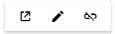

# Link in ##Platform_Name## Rich text editor control

A hyperlink can be insert into the editor for quick access to the related information. The hyperlink itself can be a text or an image.

## Insert link

Point the cursor anywhere within the editor where you would like to insert the link. It is also possible to select a text or an image within the editor and can be converted to the hyperlink. Click the Insert HyperLink tool on the toolbar. The Insert Link Dialog will be open. The dialog has the following options.

> Rich Text Editor features are segregated into individual feature-wise modules. To use image and link tool, inject link module using the `RichTextEditor.Inject(Link)`.

| Options | Description |
|----------------|--------------------------------------|
| Web Address | Type or paste the destination for the link you are creating |
| Display Text | Type or edit the required text that you want to display text for the link|
| Tooltip | To display additional helpful information when you place the pointer on the hyperlink, type the required text in the “Tooltip” field. |
| Open Link in New Window | Specify whether, the given link will be open in new window or not |

> The Rich Text Editor link tool validates the URLs, as you type them in Web Address. URLs considered invalid will be highlighted with red color by clicking the insert button in the `Insert Link` dialog.



 







        
















## Remove Link

If you want to remove a hyperlink from a text or image, select the text or image with the hyperlink and click “Remove Hyperlink” tool from the toolbar. It will keep the text or image.

## Auto-link

When you type URL, and Enter key to the Rich Text Editor, the typed URL will be automatically changed into the hyperlink.

## Manipulation

Add the custom tools on the selected link inside the Rich Text Editor through the quick toolbar.

The quick toolbar for the link has the following options.

| Tools | Description |
|----------------|--------------------------------------|
| Open | The given link page, will be open in new window. |
| Edit Link | Used to edit the link in the Rich Text Editor content. |
| Remove Link | Used to remove link from the content of Rich Text Editor. |
| Custom Tool | Used to add the custom options in the quick toolbar. |



 







        
















## See Also

* [How to edit the quick toolbar settings](./toolbar/#quick-inline-toolbar)
* [How to insert image link editing option in the toolbar items](./image/#image-with-link)